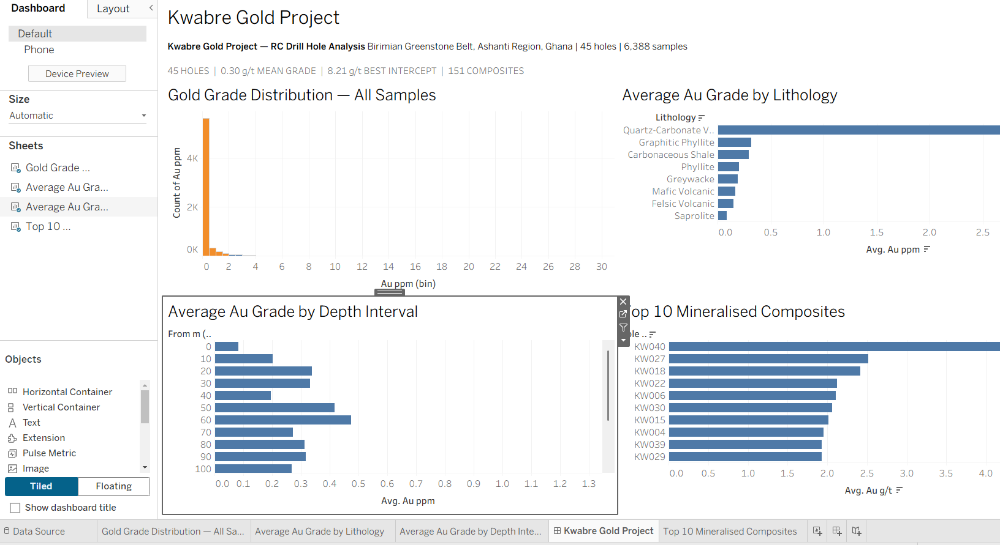
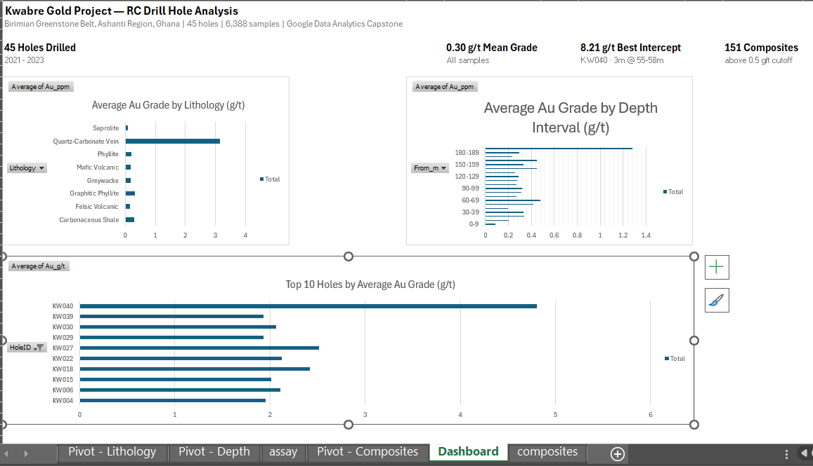

# Kwabre Gold Project — RC Drill Hole Analysis

> Capstone project for the Google Data Analytics Professional Certificate
> (Coursera, March 2026)

A Python-based data pipeline simulating RC drill hole data from a 
Birimian greenstone belt gold project in Ghana, West Africa.

## Background

This project was built by Emmanuel Ako-Addo, a geological engineer 
with hands-on RC drilling experience at Goldfields Ghana (Tarkwa Mine).
The dataset is synthetic but modelled on real Birimian greenstone belt 
geology — the same setting as major Ghanaian gold mines including 
Tarkwa, Asanko, and Bibiani.

## What this project does

Generates and analyses a synthetic but geologically realistic drill 
hole dataset, including:
- Collar locations across a 5-line, 45-hole drill grid
- Downhole lithological logging (phyllite, graphitic phyllite, 
  quartz-carbonate veins and more)
- 1-metre gold assay intervals (6,388 samples)
- Mineralised composite calculation at 0.5 g/t Au cutoff
- QA/QC outlier flagging using 3-sigma lognormal method

## Key findings

- Mean gold grade across all samples: 0.30 g/t Au
- Best intercept: 8.21 g/t Au over 3m (hole KW040, 55-58m depth)
- 151 mineralised composites identified above 0.5 g/t cutoff
- Quartz-carbonate veins confirmed as primary gold carrier at 3.15 g/t 
  average, versus 0.09 g/t for saprolite
- Grade enrichment trend identified at depth below 180m

## Files

| File | Description |
|------|-------------|
| `generate_data.py` | Main script — run this to generate all datasets |
| `collar.csv` | Drill hole collar locations and orientations |
| `lithology.csv` | Downhole lithology and alteration logging |
| `assay.csv` | 1-metre gold assay results with QA/QC flags |
| `composites.csv` | Mineralised intervals above 0.5 g/t Au cutoff |

## How to run

```bash
pip install numpy pandas
python generate_data.py
```

## Dashboards & Visualisations

| File | Description |
|------|-------------|
| [Tableau Public Dashboard](https://public.tableau.com/views/KwabreGoldProject/KwabreGoldProject) | Interactive dashboard — grade distribution, lithology, depth trends |
| [Excel Dashboard](kwabre-gold-project-dashboard.xlsx) | Pivot table dashboard with three charts |




## Tools used
- Python 3.10+
- numpy, pandas
- Tableau Public

## Certificate
[Google Data Analytics Professional Certificate](https://www.coursera.org/account/accomplishments/professional-cert/WGFOZ52YTNUV)
Completed March 2026

## Author
Emmanuel Ako-Addo | Geological Engineer & Data Analyst
[LinkedIn](https://linkedin.com/in/eakoaddo) | [GitHub](https://github.com/Ted-Lasso/kwabre-gold-project)
